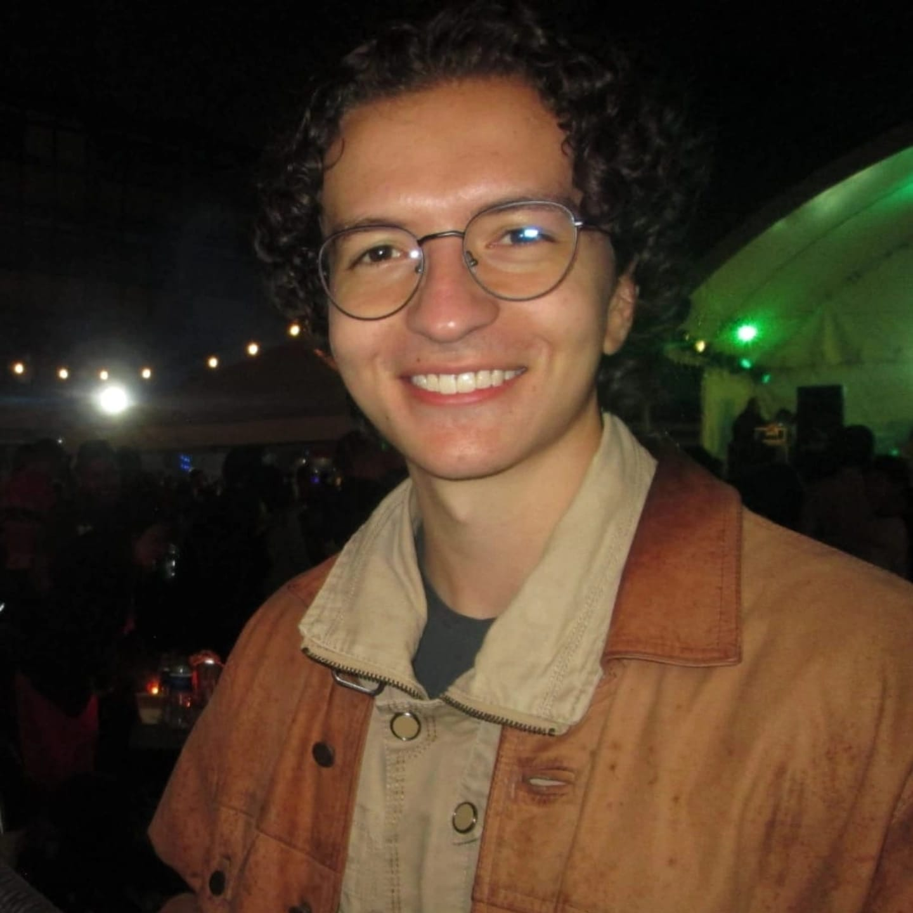

### Hi there I'm **_Santiago_** 👋 👨‍💻



```rust
use portfolio::Me;

fn main() {
  let santiago = Me {
    username: "Santicm",
    name: "Santiago Castro Muñoz",
    age: 21,
    pronouns: ("He", "Him"),
    code: vec![
      "Rust", "Python", "TypeScript", "Java", "C++", "Dart", "Kotlin", "Solidity"
    ],
    tools: {
      "back-end": vec!["Node.js", "Express", "Nestjs", "FastAPI", "Spring Boot", "Axum"],
      "web": vec!["React", "Astro", "Nextjs", "Angular", "Bootstrap", "Tailwind CSS", "Shadcn UI"],
      "mobile": vec!["Flutter", "Android"],
      "devops": vec!["AWS", "Docker", "GitHub Actions", "Vercel", "cPanel"],
      "AI": vec!["TensorFlow", "Scikit-Learn"],
      "blockchain": vec!["Hardhat", "Ethereum", "Solana"],
      "testing": vec!["Selenium", "Jest", "Pytest", "Junit"],
      "other": vec!["ZeroMQ", "Kafka", "RabbitMQ", "WebSockets", "GraphQL", "RESTful APIs"]
    }
  };
}
```

### More about me...

- 🇨🇴 I'm from Bogota, Colombia.
- 👨‍💻 I'm a systems engineering student at Pontificia Universidad Javeriana.
- 🌱 I keep learning new stuff every day.
- 🌎 Languages:
  - Español
  - Français
  - English
  - Português
- ⚡ Fun facts: I love...
  - 🎾 Tenis
  - 🎹 Piano
  - ♟️ Chess
  - 🏃‍♂️ Athletics
  - 🎵 Music
  - 🧩 Puzzles

<br>

### Find me around the web 🌎:

<br>

[](https://santicm.com)
[](https://www.linkedin.com/in/santiago-castro-2b2a77276/)
[](https://www.instagram.com/santicm23/)
[](mailto:Santicastrom@outlook.com)
