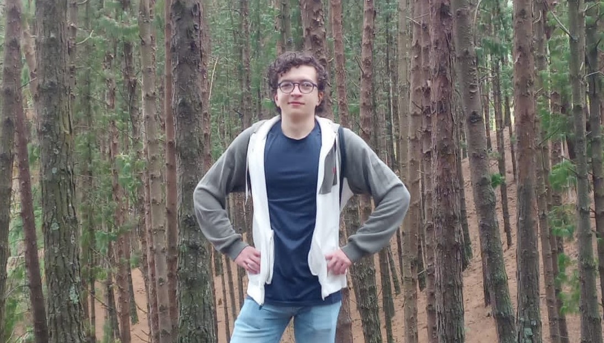

### Hi there I'm **_Santiago_** 👋 👨‍💻



```python
from dataclasses import dataclass

@dataclass
class Me:
    username: str = 'Santicm23'
    name: str = 'Santiago Castro Muñoz'
    age: int = 20
    pronouns: tuple[str, str] = ('He', 'Him')
    code: list[str] = [
				'Python', 'JavaScript', 'TypeScript', 'Dart', 'C++', 'C', 'Java', 'Kotlin', 'php', 'SQL']
    tools: dict[str, list[str]] = {
        'back-end': ['Node.js', 'Express', 'Socket.IO', 'FastAPI', 'Spring Boot', 'Firebase'],
        'web': ['React', 'Angular', 'Astro', 'Bootstrap', 'Tailwind CSS'],
        'mobile': ['Flutter', 'Android'],
        'devops': ['Docker', 'GitHub Actions', 'Railway', 'cPanel'],
        'AI': ['PyTorch', 'TensorFlow', 'Scikit-Learn'],
        'testing': ['Selenium', 'Jest', 'Pytest', 'Junit', 'Apache JMeter'],
        'other': ['Poetry', 'ZeroMQ', 'Tkinter']
    }
```

### More about me...

- 🇨🇴 I'm from Bogota, Colombia.
- 👨‍💻 I'm a systems engineering student at Pontificia Universidad Javeriana.
- 🌱 I’m currently learning React and PyTorch.
- 🌎 Languages:
  - Español
  - Français
  - English
  - Português
- ⚡ Fun facts: I love...
  - 🎾 Tenis
  - 🎹 Piano
  - ♟️ Chess
  - 🏃‍♂️ Athletics
  - 🎵 Music
  - 🧩 Puzzles

<br>

### Find me around the web 🌎:

<br>

[](https://santicm.com)
[](https://www.linkedin.com/in/santiago-castro-2b2a77276/)
[](https://www.instagram.com/santicm23/)
[](mailto:Santicastrom@outlook.com)
